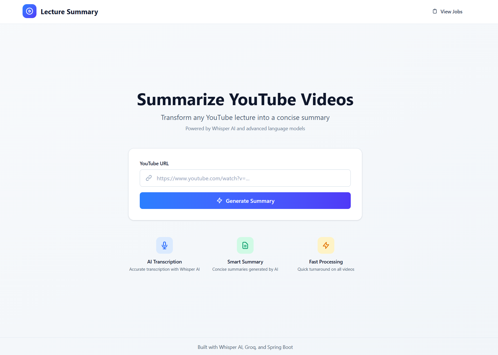
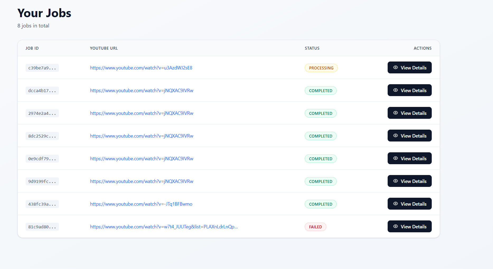
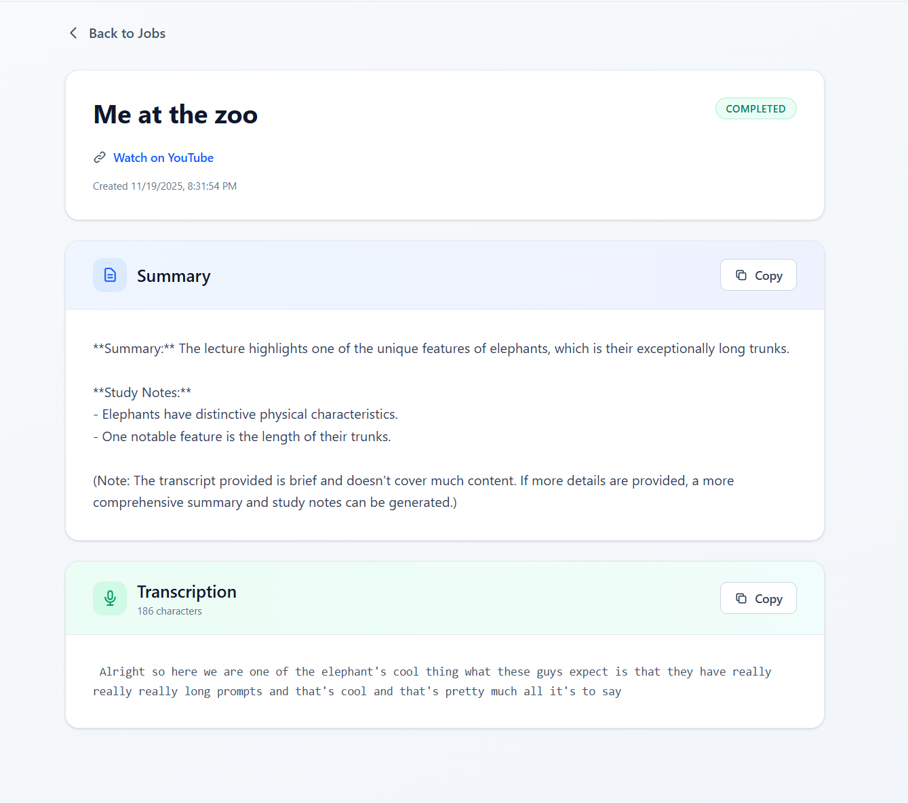

# Lecture Summary -- SCREENSHOT BELOW 📸  

A full-stack application that transforms YouTube lecture videos into concise, AI-generated summaries and transcriptions. The application leverages OpenAI's Whisper AI for accurate audio transcription and Groq's language models for intelligent summarization.

## Table of Contents

- [Overview](#overview)
- [Tech Stack](#tech-stack)
- [Architecture](#architecture)
- [Key Features](#key-features)
- [Installation](#installation)
- [Usage](#usage)
- [Screenshots](#screenshots)
- [Project Structure](#project-structure)

## Overview

Lecture Summary is designed to help students, educators, and professionals quickly extract key insights from video lectures. The application handles the entire pipeline from video download to AI-powered summarization, providing both full transcriptions and concise summaries.

## Tech Stack

### Frontend

- **React** - Modern UI library for building user interfaces
- **TypeScript** - Type-safe JavaScript for better developer experience
- **Vite** - Fast build tool and development server
- **React Router** - Client-side routing
- **Tailwind CSS** - Utility-first CSS framework for modern UI design

### Backend

- **Spring Boot** (Java) - Main application server handling job orchestration and persistence
- **FastAPI** (Python) - Microservice for video processing and AI operations
- **PostgreSQL** - Relational database for job and result storage
- **Maven** - Build automation and dependency management

### AI & Processing

- **Whisper AI** - OpenAI's speech recognition model for audio transcription
- **Groq** - High-performance language model API for text summarization
- **yt-dlp** - YouTube video downloading library
- **FFmpeg** - Audio extraction and processing

## Architecture

The application follows a microservices architecture with three main components:

### 1. Frontend (React + Vite)

- User interface for submitting YouTube URLs
- Real-time job status monitoring with polling
- Display of transcriptions and summaries
- Responsive design with modern UI components

### 2. Spring Boot Backend

- RESTful API for job management
- Job queue system with status tracking (QUEUED, PROCESSING, COMPLETED, FAILED)
- Scheduled job processor running every 10 seconds
- PostgreSQL integration for data persistence
- Communication bridge with Python worker service

### 3. Python Worker Service (FastAPI)

- Video downloading using yt-dlp
- Audio extraction from video files
- Whisper AI transcription
- Groq-powered summarization
- RESTful API endpoint for job processing

### Data Flow

```
User → Frontend → Spring Boot API → Job Queue (PostgreSQL)
                        ↓
                  Job Processor (Scheduled)
                        ↓
                Python Worker Service
                        ↓
            yt-dlp → Whisper AI → Groq
                        ↓
                PostgreSQL (Results)
                        ↓
                Frontend (Display)
```

## Key Features

### Core Functionality

- **YouTube Video Processing** - Automatic download and audio extraction from any YouTube URL
- **AI Transcription** - Highly accurate speech-to-text using Whisper AI
- **Smart Summarization** - Context-aware summaries generated by Groq's LLaMA models
- **Job Queue System** - Asynchronous processing with status tracking
- **Real-time Updates** - Automatic polling for job status updates

### User Experience

- **Modern UI Design** - Clean, minimalistic interface with Tailwind CSS
- **Status Indicators** - Color-coded job status badges (Queued, Processing, Completed, Failed)
- **Copy to Clipboard** - One-click copying of summaries and transcriptions
- **Progress Tracking** - Visual feedback during video processing
- **Error Handling** - Comprehensive error messages and retry mechanisms

### Technical Features

- **Microservices Architecture** - Separation of concerns between API and processing layers
- **Database Persistence** - All jobs and results stored in PostgreSQL
- **Scheduled Processing** - Background job processor for asynchronous execution
- **RESTful APIs** - Clean API design for frontend-backend communication
- **Type Safety** - TypeScript on frontend, Pydantic models on backend

## Installation

### Prerequisites

Ensure you have the following installed:

- **Node.js** (v16 or higher)
- **Java** (JDK 17 or higher)
- **Python** (3.8 or higher)
- **PostgreSQL** (14 or higher)
- **Maven** (3.6 or higher)
- **FFmpeg** (for audio processing)

### Environment Setup

1. **Clone the repository**

   ```bash
   git clone <repository-url>
   cd lectureSummary
   ```

2. **Database Setup**

   Create a PostgreSQL database:

   ```sql
   CREATE DATABASE lecture_summary;
   ```

3. **Backend Configuration**

   Configure `springboot-backend/src/main/resources/application.properties`:

   ```properties
   spring.datasource.url=jdbc:postgresql://localhost:5432/lecture_summary
   spring.datasource.username=your_username
   spring.datasource.password=your_password
   spring.jpa.hibernate.ddl-auto=update
   python.service.url=http://localhost:8001
   ```

4. **Python Worker Setup**

   Create a virtual environment and install dependencies:

   ```bash
   cd python-worker
   python -m venv venv
   source venv/bin/activate  # On Windows: venv\Scripts\activate
   pip install -r requirements.txt
   ```

   Configure `.env` file in `python-worker/`:

   ```
   GROQ_API_KEY=your_groq_api_key
   ```

5. **Frontend Setup**
   ```bash
   cd frontend
   npm install
   ```

### Running the Application

You can use the provided startup scripts or run each component individually:

#### Option 1: Using Startup Script (Windows)

```bash
.\start.bat
```

#### Option 2: Using Startup Script (Linux/Mac)

```bash
chmod +x start.sh
./start.sh
```

#### Option 3: Manual Startup

**Terminal 1 - Spring Boot Backend:**

```bash
cd springboot-backend
mvn spring-boot:run
```

**Terminal 2 - Python Worker:**

```bash
cd python-worker
source venv/bin/activate  # On Windows: venv\Scripts\activate
python api.py
```

**Terminal 3 - Frontend:**

```bash
cd frontend
npm run dev
```

### Accessing the Application

- **Frontend:** http://localhost:5173
- **Spring Boot API:** http://localhost:8080
- **Python Worker API:** http://localhost:8001

## Usage

### Submitting a Video for Processing

1. Navigate to the home page
2. Enter a valid YouTube URL in the input field
3. Click "Generate Summary" button
4. You will be redirected to the jobs page

### Viewing Job Status

1. On the jobs page, you can see all submitted jobs
2. Job statuses are color-coded:

   - Blue: QUEUED - Waiting to be processed
   - Yellow: PROCESSING - Currently being processed
   - Green: COMPLETED - Successfully processed
   - Red: FAILED - Processing failed

3. Click "View Details" to see the full results

### Viewing Results

On the job details page, you can:

- View the video title
- Read the AI-generated summary
- Access the full transcription
- Copy summaries or transcriptions to clipboard
- View the original YouTube video

## Screenshots

### Home Page


_Main landing page with YouTube URL input and feature highlights_

### Jobs Overview


_Table view showing all submitted jobs with status indicators_

### Job Details


_Detailed view with AI-generated summary and full transcription_

## Project Structure

```
lectureSummary/
├── frontend/                    # React + Vite frontend
│   ├── src/
│   │   ├── pages/
│   │   │   ├── Home.tsx        # Landing page with URL submission
│   │   │   ├── Processing.tsx  # Jobs list view
│   │   │   └── JobDetails.tsx  # Individual job results
│   │   ├── App.tsx
│   │   └── main.tsx
│   └── package.json
│
├── springboot-backend/          # Spring Boot API server
│   ├── src/main/java/com/necharkc/lecturesummary/
│   │   ├── Job.java            # Job entity model
│   │   ├── JobRepository.java  # JPA repository
│   │   ├── JobController.java  # REST endpoints
│   │   ├── JobProcessorService.java    # Scheduled job processor
│   │   └── PythonApiService.java       # Python worker client
│   └── pom.xml
│
├── python-worker/               # FastAPI microservice
│   ├── api.py                  # Main FastAPI application
│   ├── services/
│   │   ├── download_service.py     # Video download (yt-dlp)
│   │   ├── whisper_service.py      # Audio transcription
│   │   └── summarize.py            # Text summarization (Groq)
│   └── requirements.txt
│
├── start.bat                   # Windows startup script
├── start.sh                    # Linux/Mac startup script
└── README.MD                   # This file
```

## API Endpoints

### Spring Boot Backend (Port 8080)

#### Submit a new job

```
POST /submission
Body: { "ytlink": "https://www.youtube.com/watch?v=..." }
Response: Job object with status QUEUED
```

#### Get all jobs

```
GET /jobs
Response: Array of Job objects
```

#### Get job details

```
GET /jobs/{jobId}/details
Response: Job object with full details
```

### Python Worker (Port 8001)

#### Process video

```
POST /process
Body: { "job_id": "uuid", "video_url": "https://..." }
Response: { "success": true, "title": "...", "transcript": "...", "summary": "..." }
```

## Database Schema

### Job Table

- `id` - UUID primary key
- `url` - YouTube video URL
- `status` - Job status (QUEUED, PROCESSING, COMPLETED, FAILED)
- `title` - Video title
- `transcription` - Full transcription
- `summary` - AI-generated summary
- `error_message` - Error details if failed
- `created_at`- Job creation timestamp

## Technologies & Libraries

### Frontend Dependencies

- react
- react-dom
- react-router-dom
- typescript
- vite
- tailwindcss

### Backend Dependencies (Maven)

- spring-boot-starter-web
- spring-boot-starter-data-jpa
- postgresql
- lombok

### Python Dependencies

- fastapi
- uvicorn
- yt-dlp
- openai-whisper
- groq
- pydantic
- python-dotenv

## License

This project is licensed under the MIT License.
